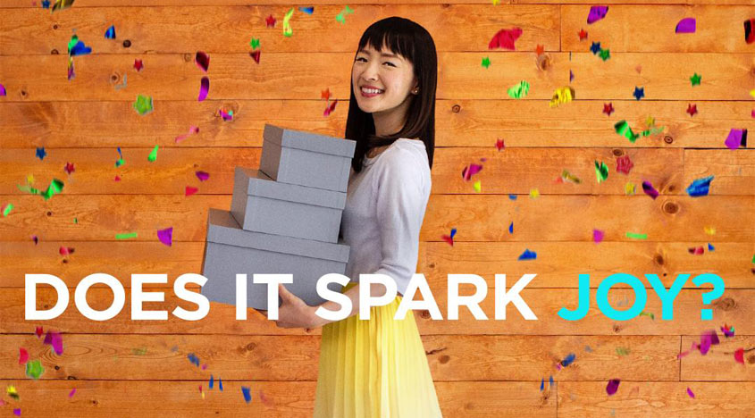

# Sparking Joy with NLP

## Problem Statements:
Using data pulled from Reddit I have built Natural Language Processing (NLP) models to answer the following questions:
* Based on text data from posts, can the model correctly classify posts from [r/konmari](https://www.reddit.com/r/konmari) vs. posts from [r/hoarding](https://www.reddit.com/r/hoarding)?

* Can the model also differentiate [r/konmari](https://www.reddit.com/r/konmari) from a larger set of posts including [r/declutter](https://www.reddit.com/r/declutter) vs. posts from [r/organization](https://www.reddit.com/r/organization)?

* What words are most important in identifying [r/konmari](https://www.reddit.com/r/konmari) posts?

* Are there certain posts with which the model has trouble? Why?

* Can the model be generalized outside [Reddit](https://www.reddit.com/)?

## Executive Summary:
The project primarily utilizes two classification models:
  * Naïve Bayes (Multinomial)
  * Logistic Regression

Each model has been performed alongside use of a TF-IDF vectorizer.

Additionally, a voting classifier model was run to see if, though more conceptually and computationally complicated, produced better results.

The NLP models herein have proven successful at accurately predicting whether a post or not a post from the [r/konmari](https://www.reddit.com/r/konmari) subreddit, though some overfitting is present.

## Data Gathering Process
I pulled Reddit posts using either the Reddit API (via the [Python Reddit API Wrapper (PRAW)](https://praw.readthedocs.io/en/latest/)) or the [Pushshift API](https://pushshift.io).

The initial dataset included 4,936 posts from r/konmari and r/hoarding with approximately 53% being from r/konmari.

## Conclusions

The NLP models that sought to classify r/hoarding and r/konmari, all showed strong results with testing scores (r-squared) of 0.95 or higher.

Once other similarly 'tidy' subreddits were introduced, accuracy scores dropped and overfitting increased, as the new posts were much more similar to the positive target than the existing observations of the negative target class.

Stemming and lemmatization was performed and although not dramatically different than the base models, a stemmed corpus might be performed due to a slight reduction in variance.

A further analysis was performed by taking transcripts of the Marie Kondo's Netflix show (scraped from https://www.springfieldspringfield.co.uk) and feeding each episode into an existing base NLP model. Interestingly, each episode of the show had differing 'levels of Konmari-ness' and each were correctly identified as being a part of the 'konmari' class.

## Further Improvements
In order to cut down on the variance, I would like to gather additional data to feed into the model. Additionally, given the interesting results with the Netflix transcripts, I'd like to test the improved model on additional non-reddit data for a more generalized model of 'Konmari-ness'.
